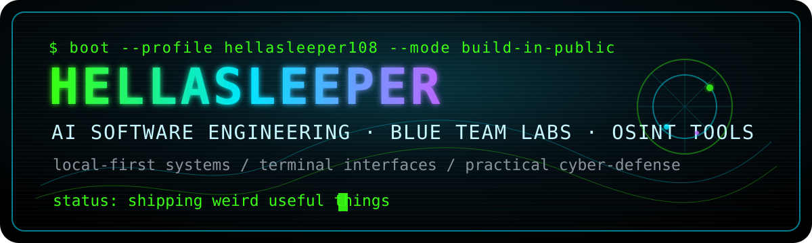
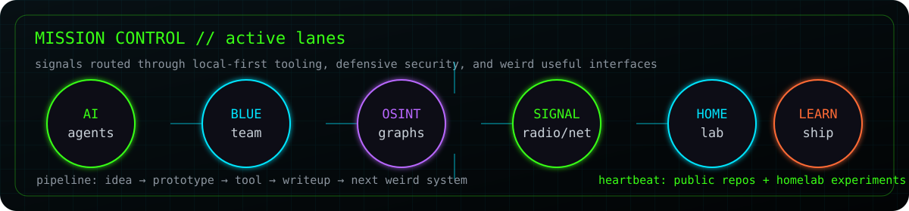

<div align="center">



<br />

<a href="https://github.com/hellasleeper108?tab=repositories"></a>
<a href="https://jaramie.com"></a>
<a href="https://www.linkedin.com/in/jaramie-morris"></a>

### `AI Software Engineering student // security-tooling builder // terminal gremlin`


</div>

---

## `whoami`

I'm **Jaramie Morris** — an AI Software Engineering student and hands-on builder crash-coursing the stack by shipping real projects.

I like systems that feel useful, tactile, and a little dangerous-looking: cyber-defense dashboards, local-first OSINT workstations, agent workflows, terminal interfaces, cyberdeck experiments, and tools that turn raw signals into decisions.

```txt
current_mode   = learning fast + building in public
primary_lane   = Python, security automation, AI-assisted software
side_quests    = Rust, SDR/radio, homelabs, embedded devices, visual command centers
operating_rule = make it work → make it understandable → make it hard to ignore
```

## `now_compiling`

- 🧠 **AI + software engineering** — studying fundamentals while building practical tools.
- 🛡️ **Blue-team / security tooling** — passive recon, threat intel, packet inspection, and investigation workflows.
- 🛰️ **Signal + network curiosity** — traceroute maps, SDR experiments, Reticulum/LXMF, and homelab telemetry.
- 🕹️ **Learning experiences** — gamified Python, terminal learning tools, and weird interfaces that make practice stick.
- 🧰 **Operator mindset** — local tech repair, real-world troubleshooting, and shipping things people can actually use.

## `mission_control`

<div align="center">



</div>

## `featured_systems`

| Project | What it is | Stack / vibe |
|---|---|---|
| [`SignalForge`](https://github.com/hellasleeper108/SignalForge) | Local-first OSINT investigation workstation for graph-centric research and cyber analysis. | OSINT · graphs · threat hunting |
| [`tracemap`](https://github.com/hellasleeper108/tracemap) | Old-school traceroute energy, but plotted on a map with connected IP visibility. | Python · Leaflet · network viz |
| [`Blue-Meanie`](https://github.com/hellasleeper108/Blue-Meanie) | Rust-based blue team tooling playground. | Rust · defensive security |
| [`sentinel-gate`](https://github.com/hellasleeper108/sentinel-gate) | Pre-host packet inspection system. | network defense · inspection |
| [`sleePY`](https://github.com/hellasleeper108/sleePY) | Gamified Python learning app. | Python · learning systems |
| [`V0id`](https://github.com/hellasleeper108/V0id) | A terminal learning experience with hacker-console flavor. | terminal UX · education |
| [`5-dollar-soc`](https://github.com/hellasleeper108/5-dollar-soc) | Why a tiny VPS can become a serious security lab. | SOC · VPS · practical ops |
| [`hermes-adv`](https://github.com/hellasleeper108/hermes-adv) | Hermes Agent bridge experiments for the Cardputer ADV. | agents · embedded · cyberdeck |

## `latest_transmissions`

<!-- LATEST-TRANSMISSIONS:START -->
| Transmission | Signal | Stack | Last ping |
|---|---|---:|---:|
| [`LiNvidia-Broadcast`](https://github.com/hellasleeper108/LiNvidia-Broadcast) | Nvidia Broadcast for Linux | `Python` | `2026-07-11` |
| [`5-dollar-soc`](https://github.com/hellasleeper108/5-dollar-soc) | Why I decided to get a $5 VPS (and you should too) | `HTML` | `2026-07-05` |
| [`brats_medical_segmentation`](https://github.com/hellasleeper108/brats_medical_segmentation) |  BraTS Medical Image Segmentation - 85.51% Dice Score    State-of-the-art 3D U-Net for brain tumor segmentation achieving 85.51% Dice score on BraTS 2021 dataset.  | `Python` | `2026-07-01` |
| [`tracemap`](https://github.com/hellasleeper108/tracemap) | Like ol' school traceroute...but on a map. Lists all IP's currently connected to and where.  | `Python` | `2026-06-10` |
| [`V0id`](https://github.com/hellasleeper108/V0id) | A fun terminal learning experience | `mixed` | `2026-06-07` |
| [`Idea-Journal`](https://github.com/hellasleeper108/Idea-Journal) | A place to shelf ideas while I continue to develop projects | `Python` | `2026-06-05` |
| [`hermes-adv`](https://github.com/hellasleeper108/hermes-adv) | Hermes agent bridge for the Cardputer ADV | `C++` | `2026-05-23` |
| [`do-not-sleep`](https://github.com/hellasleeper108/do-not-sleep) | Do Not Sleep — a static manifesto page | `HTML` | `2026-05-22` |

<sub>Auto-refreshed from public repo metadata by `.github/workflows/update-profile.yml`.</sub>
<!-- LATEST-TRANSMISSIONS:END -->

## `signal_map`

<!-- SIGNAL-MAP:START -->
<p>
  
  
  
  
  
  
  
  
  
</p>
<!-- SIGNAL-MAP:END -->

## `toolbelt`

<p>
  
  
  
  
  
  
  
  
  
  
</p>

## `github_telemetry`

<div align="center">


</div>

## `operating_principles`

```txt
[01] Learn in public. Ship the reps.
[02] Prefer tools that can be used locally, understood deeply, and repaired under pressure.
[03] Make cyber work ethical, passive-first, and defense-oriented.
[04] Build interfaces with atmosphere — terminals, maps, graphs, dashboards, signal boards.
[05] Keep moving. The next version can always be sharper.
```

---

<div align="center">

### `connect`

[Portfolio](https://jaramie.com) · [GitHub](https://github.com/hellasleeper108) · [LinkedIn](https://www.linkedin.com/in/jaramie-morris)

<sub>“Do not sleep. Compile the future.”</sub>

</div>
